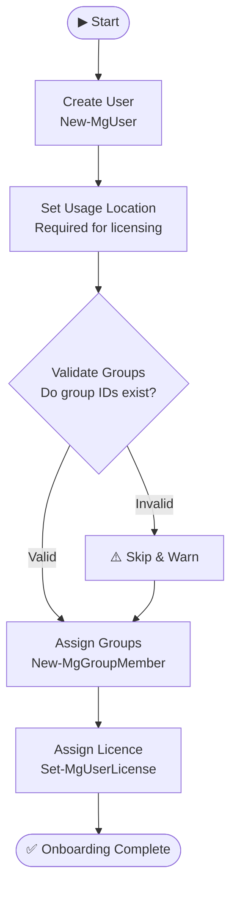
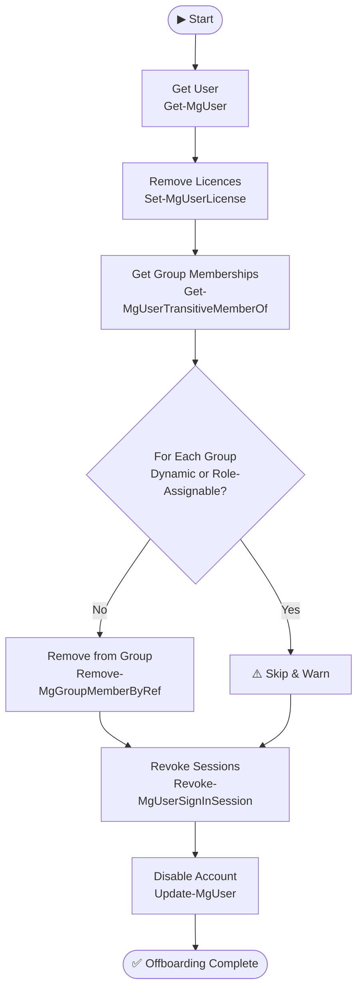

# Microsoft 365 Identity Lifecycle Automation Lab

> Automating enterprise user onboarding and offboarding with Microsoft Graph PowerShell and Entra ID.

---

## 📋 Project Summary

This lab simulates a real-world IT automation workflow for managing the full identity lifecycle of employees in a Microsoft 365 environment. Using Microsoft Graph PowerShell, the project automates the provisioning and deprovisioning of user accounts — tasks that are central to any enterprise IT or Identity & Access Management (IAM) operation.

The project demonstrates practical skills in:

- Automating user provisioning via the Microsoft Graph API
- Managing licenses, group memberships, and account states programmatically
- Writing production-quality PowerShell with robust error handling and structured output
- Applying security best practices such as session revocation and immediate access removal on offboarding

This is directly applicable to roles in IT Support, Systems Administration, Identity Engineering, and Microsoft 365 Administration.

---

## 🧪 Scenario

The following scripts simulate the onboarding and offboarding of a Finance department employee.

| Field | Value |
|---|---|
| **Name** | John Doe |
| **Role** | Finance Analyst |
| **Department** | Finance |
| **User Principal Name** | john.doe@contoso.com |

The onboarding script provisions John's account, assigns him to relevant groups, and allocates a Microsoft 365 licence. The offboarding script reverses this — removing licences, revoking sessions, stripping group memberships, and disabling the account.

---

## 🎯 Objectives

| Objective | Description |
|---|---|
| **User Creation** | Create a new Entra ID (Azure AD) user with correct attributes |
| **Licence Assignment** | Assign a Microsoft 365 licence appropriate to the user's role |
| **Group Assignment** | Add the user to relevant security and Microsoft 365 groups |
| **Access Removal** | Remove all licences and group memberships on departure |
| **Session Revocation** | Immediately invalidate all active sign-in sessions |
| **Account Disablement** | Disable the account to prevent further authentication |

---

## 🛠️ Tools & Technologies

- **PowerShell** — scripting language used throughout
- **Microsoft Graph PowerShell SDK** — official Microsoft module for interacting with the Graph API (`Microsoft.Graph`)
- **Microsoft 365** — platform providing the user directory, licences, and groups
- **Entra ID (Azure AD)** — identity provider managing users, groups, and roles
- **Mermaid** — used for workflow diagrams in this README

---

## 📁 Project Structure

```
m365-identity-lifecycle-lab/
│
├── scripts/
│   ├── onboarding.ps1          # Core function: New-CompanyUser
│   ├── onboard-user.ps1        # Example: runs the onboarding workflow
│   ├── offboarding.ps1         # Core function: Remove-CompanyUserAccess
│   └── offboard-user.ps1       # Example: runs the offboarding workflow
│
└── README.md
```

---

## 🟢 Onboarding Workflow

The `New-CompanyUser` function in `onboarding.ps1` executes the following steps:

**1. User Creation**
A new Entra ID user account is created using `New-MgUser`, with attributes including display name, UPN, department, job title, and a temporary password. The account is created in an enabled state.

**2. Usage Location Assignment**
A usage location (e.g. `GB`) is set on the user object. This is a required prerequisite before any Microsoft 365 licence can be assigned.

**3. Group Validation & Assignment**
Each target group ID is validated via `Get-MgGroup` before attempting to add the user. This prevents silent failures caused by invalid or deleted group references. The user is added using `New-MgGroupMember`.

**4. Licence Assignment**
Once the usage location is confirmed, the specified SKU licence is assigned using `Set-MgUserLicense`. The function handles the `AddLicenses` payload correctly as an array of licence objects.

---

## 🔴 Offboarding Workflow

The `Remove-CompanyUserAccess` function in `offboarding.ps1` executes the following steps:

**1. Licence Removal**
All assigned licences are retrieved from the user object and passed to `Set-MgUserLicense` with an empty `AddLicenses` array and the full list of SKU IDs in `RemoveLicenses`.

**2. Group Membership Removal**
`Get-MgUserTransitiveMemberOf` retrieves all group memberships, including nested ones. The script filters to `#microsoft.graph.group` types, checks for dynamic or role-assignable groups (which cannot be manually modified), and calls `Remove-MgGroupMemberByRef` for each eligible group.

**3. Session Revocation**
`Revoke-MgUserSignInSession` is called to immediately invalidate all active tokens and sessions, cutting off access across all connected apps and services.

**4. Account Disablement**
`Update-MgUser` sets `AccountEnabled` to `$false`, preventing the user from authenticating even if a session token were somehow still valid.

---

## 📊 Flow Diagrams

### Onboarding Flow



### Offboarding Flow



---

## ▶️ Example Usage

### Prerequisites

```powershell
# Install the Microsoft Graph module if not already installed
Install-Module Microsoft.Graph -Scope CurrentUser

# Connect with the required permissions
Connect-MgGraph -Scopes "User.ReadWrite.All","GroupMember.ReadWrite.All","Directory.ReadWrite.All","Organization.Read.All"
```

### Run Onboarding

```powershell
# From the repo root
Set-Location "C:\path\to\m365-identity-lifecycle-lab"

.\scripts\onboard-user.ps1
```

`onboard-user.ps1` calls `New-CompanyUser` with the target user's attributes and group/licence IDs:

```powershell
. "$PSScriptRoot\onboarding.ps1"

New-CompanyUser `
    -DisplayName      "John Doe" `
    -UserPrincipalName "john.doe@contoso.com" `
    -Department       "Finance" `
    -JobTitle         "Finance Analyst" `
    -UsageLocation    "GB" `
    -LicenseSkuId     "<your-sku-id>" `
    -GroupIds         @("<group-id-1>", "<group-id-2>")
```

### Run Offboarding

```powershell
.\scripts\offboard-user.ps1
```

`offboard-user.ps1` calls `Remove-CompanyUserAccess` with the target UPN:

```powershell
. "$PSScriptRoot\offboarding.ps1"

Remove-CompanyUserAccess -UserPrincipalName "john.doe@contoso.com"
```

---

## ✨ Features

**Error Handling**
All operations are wrapped in `try/catch` blocks. Failures at the group level are caught individually so a single problem does not abort the entire offboarding run. Top-level failures return a structured error object.

**Validation**
Group IDs are validated before assignment during onboarding. Empty or null values are caught early with descriptive warnings rather than causing obscure downstream errors.

**Automated Group Discovery**
The offboarding function uses `Get-MgUserTransitiveMemberOf` to automatically discover all group memberships — including nested ones — without requiring a hardcoded list. Dynamic and role-assignable groups are detected and skipped with a warning.

**Structured Output**
Both functions return a `PSCustomObject` with key fields (UPN, user ID, status, counts of groups and licences processed), making the output easy to pipe, log, or integrate into larger automation pipelines.

---

## ⚠️ Limitations

- **Dynamic group membership cannot be removed manually.** If a user is assigned to a group via a membership rule (e.g. based on `Department` attribute), they must be removed by changing the attribute that satisfies the rule.
- **Elevated Graph permissions are required.** The scripts require scopes including `User.ReadWrite.All`, `GroupMember.ReadWrite.All`, and `Directory.ReadWrite.All`. Role-assignable group removal additionally requires `RoleManagement.ReadWrite.Directory`.
- **Console output only.** There is no file-based logging in the current version. All status messages are written to the host via `Write-Host` and `Write-Warning`.
- **Single user operation only.** The current functions process one user at a time. Bulk operations from a CSV or list are not yet supported.

---

## ✅ Validation Checklist

Use the following to verify a successful run:

**Onboarding**
- [ ] User account created and visible in Entra ID
- [ ] Usage location set correctly on the user object
- [ ] User added to all specified groups
- [ ] Microsoft 365 licence assigned and active

**Offboarding**
- [ ] All licences removed from the user
- [ ] User removed from all eligible group memberships
- [ ] Active sign-in sessions revoked
- [ ] Account disabled (cannot authenticate)

---

## 🏢 Real-World Relevance

In enterprise environments, user onboarding and offboarding are among the most frequent and risk-sensitive IT tasks. Performing these manually is slow, error-prone, and a security liability — particularly offboarding, where delayed access removal can result in data breaches or compliance violations.

This project maps directly to tasks performed by:

- **IT Support / Helpdesk** — executing joiner/leaver processes
- **Systems Administrators** — managing identity and access at scale
- **Microsoft 365 Administrators** — controlling licence allocation and group membership
- **Identity & Access Management (IAM) Engineers** — building and maintaining lifecycle automation

The patterns used here — Graph API interaction, structured error handling, and modular function design — are the same foundations used in production automation built with tools like Azure Automation, Logic Apps, and Entra Lifecycle Workflows.

---

## 🚀 Future Improvements

- **File-based logging** — write timestamped output to a `.log` or `.csv` file for auditability
- **Bulk onboarding from CSV** — accept a CSV file as input to provision multiple users in a single run
- **PowerShell module conversion** — package the functions as a proper `.psm1` module with a manifest for easier distribution and versioning
- **`-WhatIf` support** — add `SupportsShouldProcess` to allow dry-run previews without making changes
- **Email notification** — send confirmation emails to IT or HR on completion using the Graph Mail API
- **Entra Lifecycle Workflow integration** — extend the scripts to trigger or complement native Entra ID lifecycle workflows

---

## 📄 Licence

This project is intended for educational and portfolio purposes. No warranty is provided. Always test automation scripts in a non-production tenant before deploying to live environments.